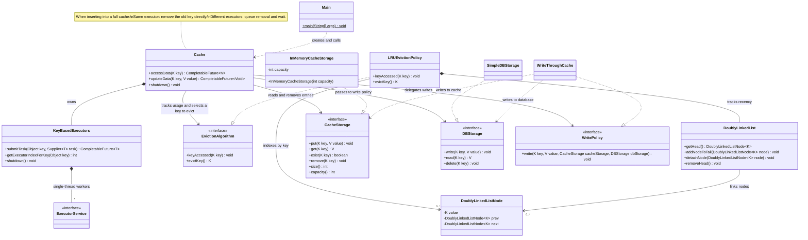

# Cache Class Diagram

```mermaid
classDiagram
    direction TB

    class Main {
        +main(String[] args) void$
    }

    class Cache {
        +accessData(K key) CompletableFuture~V~
        +updateData(K key, V value) CompletableFuture~Void~
        +shutdown() void
    }

    class KeyBasedExecutors {
        +submitTask(Object key, Supplier~T~ task) CompletableFuture~T~
        +getExecutorIndexForKey(Object key) int
        +shutdown() void
    }

    class ExecutorService {
        <<interface>>
    }

    class EvictionAlgorithm {
        <<interface>>
        +keyAccessed(K key) void
        +evictKey() K
    }

    class LRUEvictionPolicy {
        +keyAccessed(K key) void
        +evictKey() K
    }

    class DoublyLinkedList {
        +getHead() DoublyLinkedListNode~K~
        +addNodeToTail(DoublyLinkedListNode~K~ node) void
        +detachNode(DoublyLinkedListNode~K~ node) void
        +removeHead() void
    }

    class DoublyLinkedListNode {
        -K value
        -DoublyLinkedListNode~K~ prev
        -DoublyLinkedListNode~K~ next
    }

    class CacheStorage {
        <<interface>>
        +put(K key, V value) void
        +get(K key) V
        +exist(K key) boolean
        +remove(K key) void
        +size() int
        +capacity() int
    }

    class InMemoryCacheStorage {
        -int capacity
        +InMemoryCacheStorage(int capacity)
    }

    class DBStorage {
        <<interface>>
        +write(K key, V value) void
        +read(K key) V
        +delete(K key) void
    }

    class SimpleDBStorage

    class WritePolicy {
        <<interface>>
        +write(K key, V value, CacheStorage cacheStorage, DBStorage dbStorage) void
    }

    class WriteThroughCache

    Main ..> Cache : creates and calls

    Cache *-- KeyBasedExecutors : owns
    KeyBasedExecutors *-- "*" ExecutorService : single-thread workers

    Cache --> EvictionAlgorithm : tracks usage and selects a key to evict
    Cache --> CacheStorage : reads and removes entries
    Cache --> DBStorage : passes to write policy
    Cache --> WritePolicy : delegates writes

    LRUEvictionPolicy ..|> EvictionAlgorithm
    InMemoryCacheStorage ..|> CacheStorage
    SimpleDBStorage ..|> DBStorage
    WriteThroughCache ..|> WritePolicy

    LRUEvictionPolicy *-- DoublyLinkedList : tracks recency
    LRUEvictionPolicy --> "0..*" DoublyLinkedListNode : indexes by key
    DoublyLinkedList --> "0..*" DoublyLinkedListNode : links nodes

    WriteThroughCache ..> CacheStorage : writes to cache
    WriteThroughCache ..> DBStorage : writes to database

    note for Cache "When inserting into a full cache:\nSame executor: remove the old key directly.\nDifferent executors: queue removal and wait."
```
